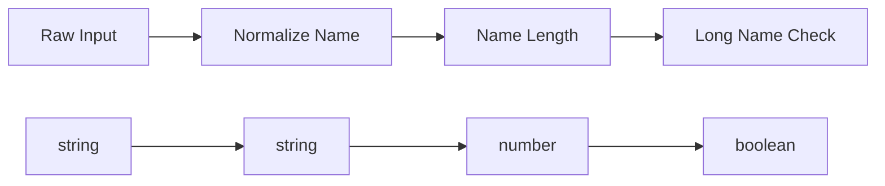

# Part 1：写像としてのプログラム

この Part から、我々は「コードを書く技術」ではなく「構造を設計する技術」へ入っていく。

ここで問いたいのは、関数が何をするかではない。

どのような形で世界を切り分け、どのように接続可能にするかである。

AI は局所的な実装を生成できる。

しかし、何をどの型に分け、どこで失敗を明示し、どの単位で合成可能にするかは、依然として人間の仕事である。

本書の立場では、

> プログラムとは、写像の設計である

そして、

> バグとは、合成できないものを合成した結果として現れる

Part 1 では、この視点を最初の足場として固める。

---

## Chapter 9：関数は処理ではない

### 問題提起

初学者向けの説明では、関数はしばしば「処理をまとめたもの」と教えられる。

たとえば次のような説明である。

```ts
const normalizeName = (raw: string): string => {
  return raw.trim().toLowerCase()
}
```

この説明は実務上まったく役に立たないわけではない。

しかし、この理解のまま設計を進めると、関心はすぐに実装へ落ちる。

- 何行で書くか
- 途中変数を置くか
- ループかメソッドチェーンか

こうして、最も重要な問いが消える。

> これは何から何への写像なのか

`normalizeName` の本質は「文字列を整形する処理」ではない。

`string -> string` という境界を持つ射である。

この視点を失うと、関数はただの手続きになり、合成可能性の議論が始まらない。

### 直感的説明

関数を「処理」として見ると、中身に目が向く。

関数を「写像」として見ると、入口と出口に目が向く。

この差は小さくない。

たとえば次の3つを見てみる。

```ts
const normalizeName = (raw: string): string =>
  raw.trim().toLowerCase()

const nameLength = (name: string): number =>
  name.length

const isAdultAge = (age: number): boolean =>
  age >= 18
```

実装はそれぞれ違う。

しかし構造として読めば、見えるのは次だけである。

```text
normalizeName: string -> string
nameLength: string -> number
isAdultAge: number -> boolean
```

ここで重要なのは、「どう計算するか」より先に「どこへ接続できるか」が見えることだ。

`normalizeName` の後ろには `nameLength` がつながる。
`isAdultAge` はつながらない。

この「つながる／つながらない」の判定こそが、設計の最初の判断である。

### 抽象の導入

ここで、プログラムを次のように読み替える。

- 型は対象
- 関数は射
- プログラムは射の合成

つまり、関数とは

```text
A -> B
```

という形を持つ構造である。

この読み方に立つと、関数本体は「射の具体的な実現」にすぎない。

本質は、`A` から `B` へ何が保証されているかである。

設計とは、

1. 対象を切り分け
2. 射を定め
3. 合成可能な連鎖を作る

ことになる。

ここでようやく、プログラムは命令列ではなく構造になる。

### TypeScriptコード

```ts
type RawUser = {
  name: string
  ageText: string
}

type UserProfile = {
  normalizedName: string
  age: number
}

const normalizeName = (raw: string): string =>
  raw.trim().toLowerCase()

const parseAge = (ageText: string): number =>
  Number(ageText)

const toUserProfile = (raw: RawUser): UserProfile => ({
  normalizedName: normalizeName(raw.name),
  age: parseAge(raw.ageText),
})
```

この例はまだ安全ではない。

だが少なくとも、

```text
normalizeName: string -> string
parseAge: string -> number
toUserProfile: RawUser -> UserProfile
```

という写像の形として読むことはできる。

実装より先に、この形を把握すること。

それが構造設計の入口である。

### 数学的補足

集合の圏 `Set` を直感的なモデルとして使うなら、対象は集合、射は全関数である。

このとき `f: A -> B` は、「`A` のすべての要素を `B` の要素へ対応づける規則」を意味する。

ここで重要なのは全域性である。

一部の入力で結果を返せないものは、本来この形ではない。

つまり、`A -> B` と型に書いた瞬間、その関数は「常に `B` を返す」と主張している。

この主張が嘘であれば、その時点で構造は壊れている。

### まとめ

関数は処理ではない。

関数は、境界を持つ写像である。

実装はその内側にある局所的詳細にすぎない。

AI 協働開発において人間がまず見るべきなのは、コードの巧拙ではなく、射の形である。

---

## Chapter 10：合成

### 問題提起

単独の関数は、それだけではまだ部品にすぎない。

プログラムになるのは、それらが接続されるときである。

たとえば次のようなコードは自然に読める。

```ts
const normalizeName = (raw: string): string =>
  raw.trim().toLowerCase()

const nameLength = (name: string): number =>
  name.length

const isLongName = (length: number): boolean =>
  length >= 8

const result = isLongName(nameLength(normalizeName("  Ada Lovelace  ")))
```

なぜこのコードは読めるのか。

なぜこの接続は不自然ではないのか。

理由は単純である。

前の出力型が、次の入力型と一致しているからだ。

```text
string -> string -> number -> boolean
```



ここではじめて、プログラムの本体が「関数」ではなく「接続」にあることが見える。

### 直感的説明

合成とは、ある関数の出力を、次の関数の入力へ受け渡すことである。

```text
f: A -> B
g: B -> C
```

このとき、`f` と `g` はつながる。

そして全体として、

```text
g . f: A -> C
```

という新しい写像ができる。

重要なのは、合成後のものもまた写像であるという点だ。

つまり設計とは、小さな射を並べることではなく、合成によってより大きな射を育てることである。

### 抽象の導入

合成を明示的な操作として書けば、我々は次の形を得る。

```text
compose: (B -> C) -> (A -> B) -> (A -> C)
```

これは非常に重要である。

なぜなら、ここでは個々のビジネスロジックが一切現れていないからだ。

現れているのは、ただ

- 接続点 `B`
- 入口 `A`
- 出口 `C`

だけである。

つまり合成とは、「処理内容」に依存しない構造的操作である。

この段階で設計者の問いは変わる。

「どう書くか」ではなく、

> この写像列は合成可能か

が中心になる。

### TypeScriptコード

```ts
const compose =
  <A, B, C>(g: (b: B) => C, f: (a: A) => B) =>
  (a: A): C =>
    g(f(a))

const normalizeName = (raw: string): string =>
  raw.trim().toLowerCase()

const nameLength = (name: string): number =>
  name.length

const isLongName = (length: number): boolean =>
  length >= 8

const isLongNormalizedName =
  compose(isLongName, compose(nameLength, normalizeName))
```

`isLongNormalizedName` は新しい関数ではない。

より正確には、新しい合成射である。

```text
string -> boolean
```

この表現が定着すると、実装の粒度と設計の粒度が分離し始める。

AI に個々の関数実装を書かせることはできる。

しかし、どの射をどの順序で合成するかは、構造を理解していなければ決められない。

### 数学的補足

圏において、射の合成は基本演算である。

`f: A -> B` と `g: B -> C` に対して、`g ∘ f: A -> C` が定まる。

さらに、合成には結合律がある。

```text
h ∘ (g ∘ f) = (h ∘ g) ∘ f
```

これが重要なのは、プログラムを安全に再構成できるからである。

部品の括り方を変えても意味が変わらない。

局所的な整理が、全体の意味を壊さない。

これはリファクタリング可能性の根にある性質である。

### まとめ

プログラムは関数の集合ではない。

合成された写像である。

設計の質は、個々の関数の賢さより、接続の正しさで決まる。

---

## Chapter 11：合成が壊れる瞬間

### 問題提起

ここまでは美しく見える。

だが現実のコードベースでは、合成は頻繁に壊れる。

しかも厄介なのは、壊れるまで型上は接続できているように見えることだ。

たとえば次のコードを考える。

```ts
type User = {
  name: string
}

const findUser = (id: number): User =>
  id === 0
    ? (undefined as never)
    : { name: "Ada" }

const getName = (user: User): string =>
  user.name

const name = getName(findUser(0))
```

表面上の型はこう読める。

```text
findUser: number -> User
getName: User -> string
```

だから合成できるように見える。

しかし実行時には壊れる。

ここで起きていることは、単なる「不注意」ではない。

構造的な虚偽である。

### 直感的説明

`findUser` は本当は `User` を返していない。

返しているのは、

- `User` が存在する場合
- 存在しない場合

のどちらかである。

つまり実際の形は、

```text
number -> User | undefined
```

であって、

```text
number -> User
```

ではない。

合成が壊れたのは、`getName` が悪いからではない。

前段の関数が「欠落」を型に出さず、接続点に嘘を持ち込んだからである。

バグはロジックの末端ではなく、境界の偽装から生まれる。

### 抽象の導入

ここで初めて、「部分関数」という概念が必要になる。

数学的には `A -> B` は全域関数である。

だがプログラム上の多くの関数は、一部の入力で値を返せない。

そのとき、それは本来

```text
A -> B
```

ではなく、

```text
A -> B + 失敗
```

の形を持っている。

この「失敗込みの構造」を隠したままでは、合成は正しく扱えない。

したがって必要なのは、

- 失敗を例外へ逃がさない
- `undefined` を闇に沈めない
- 欠落を型へ引き上げる

ことである。

### TypeScriptコード

```ts
type User = {
  name: string
}

type Option<A> = A | null

const findUser = (id: number): Option<User> =>
  id === 0 ? null : { name: "Ada" }

const getName = (user: User): string =>
  user.name

const user = findUser(0)

const name: Option<string> =
  user === null ? null : getName(user)
```

このコードは少し冗長に見える。

だが重要なのは、美しさではない。

失敗可能性が構造として表面化したことである。

この瞬間、バグは「偶発的な事故」ではなく、「型上で管理すべき接続条件」へ変わる。

### 数学的補足

部分関数は、そのままでは通常の圏の射として扱いにくい。

そこで実装上は、「失敗を値として持つ全関数」に変換する。

たとえば `Option<B>` を使えば、

```text
A -> Option<B>
```

という全関数として記述できる。

これは「失敗をなくす」のではない。

「失敗を構造化する」のである。

この違いは決定的である。

### まとめ

合成が壊れるのは、たいてい型に現れていない条件があるからである。

構造の仕事は、その隠れた条件を表面へ出すことにある。

バグとは、合成の失敗である。

この命題は、ここではじめて具体的な意味を持つ。

---

## Chapter 12：Optionによる回復

### 問題提起

欠落可能性を `Option` として表したことで、嘘は減った。

だがまだ問題は残っている。

呼び出し側のいたるところに分岐が漏れるのである。

```ts
const user = findUser(1)
const name =
  user === null ? null : getName(user)
```

これが一箇所ならまだよい。

しかし現実には、

- `findUser`
- `findProfile`
- `parseDate`
- `head`

のような失敗可能な関数が大量に現れる。

そのたびに `null` 判定を手で書いていたら、構造は再び崩れる。

失敗を型に持ち上げても、操作の形式がなければ、設計は回復しない。

### 直感的説明

欲しいのは単純である。

`Option<A>` の中に `A` が入っているなら、それに `A -> B` を適用したい。

ただし、`null` なら何もせず、`null` のままでいてほしい。

つまり、

```text
A -> B
```

という普通の写像を、

```text
Option<A> -> Option<B>
```

へ持ち上げたいのである。

このとき保存したいものは2つある。

- 中身に対する変換
- 欠落という文脈

言い換えれば、「値だけ変えて、失敗の形は保つ」操作が必要になる。

### 抽象の導入

この操作を `map` と呼ぶ。

`Option` に対して書けば、直感的には次の形である。

```text
mapOption: (A -> B) -> (Option<A> -> Option<B>)
```

あるいは引数の順序を変えて、

```text
mapOption: Option<A> -> (A -> B) -> Option<B>
```

としてもよい。

本質は同じである。

`map` がやっていることは、失敗処理ではない。

分岐の隠蔽でもない。

文脈を壊さずに写像を適用することだ。

この一歩によって、`Option` は単なる「null の別名」ではなく、構造としての器になる。

### TypeScriptコード

```ts
type Option<A> = A | null

type User = {
  name: string
}

const mapOption = <A, B>(
  f: (a: A) => B,
  oa: Option<A>
): Option<B> =>
  oa === null ? null : f(oa)

const findUser = (id: number): Option<User> =>
  id === 0 ? null : { name: "Ada" }

const getName = (user: User): string =>
  user.name

const toUpper = (s: string): string =>
  s.toUpperCase()

const userName: Option<string> =
  mapOption(getName, findUser(1))

const loudUserName: Option<string> =
  mapOption(toUpper, userName)
```

ここで重要なのは、`null` 判定が利用側から後退したことだ。

構造を一箇所へ押し込め、合成可能性を回復している。

### 数学的補足

`Option` はしばしば

```text
Option(A) = A + 1
```

と理解される。

ここで `1` は「値を一つだけ持つ型」であり、欠落の印として振る舞う。

`map` はこの構造を保ったまま、左側の `A` 部分にだけ関数を作用させる。

したがって `map` は、

- `null` を勝手に値へ変えない
- 値を勝手に `null` にしない

という意味で、文脈保存的である。

これが後に Functor と呼ばれる性質の核になる。

### まとめ

`Option` は `null` を隠すための道具ではない。

欠落可能性を構造として保持するための型である。

`map` は、その構造を壊さずに写像を持ち上げる最初の操作である。

---

## Chapter 13：Functorの導入

### 問題提起

ここまで来ると、ある種の既視感が現れる。

`Option` に対してやったことは、実は `Array` や `Promise` に対しても見覚えがある。

```ts
const lengths = ["ada", "turing"].map((s) => s.length)
```

```ts
const next = Promise.resolve(41).then((n) => n + 1)
```

形は違うが、やっていることは似ている。

- 中身の値に関数を適用する
- 外側の文脈は保存する

もしこれが偶然でないなら、`Option` 固有の話ではなく、より一般の構造があるはずである。

### 直感的説明

`Array<A>` は「複数の `A`」という文脈を持つ。

`Option<A>` は「欠落するかもしれない `A`」という文脈を持つ。

`Promise<A>` は「まだ得られていない `A`」という文脈を持つ。

これらは値を直接持つのではなく、ある文脈の中に値を保持している。

そして我々は、その中身に対して `A -> B` を作用させたい。

このとき求められるのは毎回同じである。

```text
文脈 F を保ったまま
A -> B を
F<A> -> F<B> へ持ち上げる
```

この「持ち上げ可能性」が抽象としてまとまったものが Functor である。

### 抽象の導入

Functor は、ざっくり言えば「写像を文脈つきの写像へ持ち上げられる構造」である。

形だけ書けば、

```text
map: (A -> B) -> F<A> -> F<B>
```

となる。

ここで大事なのは、Functor が「コンテナの種類」ではないという点だ。

Functor は能力である。

より正確には、

> 文脈を保存しながら写像を適用できるという構造的能力

である。

この視点に立つと、`map` は単なる便利メソッドではなくなる。

それは「合成を文脈の外側へ持ち上げる」ための装置である。

### TypeScriptコード

```ts
type Option<A> = A | null

const mapOption = <A, B>(
  f: (a: A) => B,
  oa: Option<A>
): Option<B> =>
  oa === null ? null : f(oa)

const mapArray = <A, B>(
  f: (a: A) => B,
  as: A[]
): B[] =>
  as.map(f)

const increment = (n: number): number =>
  n + 1

const optionResult: Option<number> =
  mapOption(increment, 41)

const arrayResult: number[] =
  mapArray(increment, [1, 2, 3])
```

`Option` と `Array` はまったく違う文脈を持つ。

しかし `map` という操作の型は驚くほど似ている。

```text
Option<A> -> Option<B>
Array<A> -> Array<B>
```

ここに見えているのは「実装の共通性」ではない。

構造の共通性である。

### 数学的補足

圏論では Functor は、ある圏から別の圏への構造保存写像として定義される。

直感的には、

- 対象を対象へ送る
- 射を射へ送る
- 恒等射と合成を保つ

ものだと考えればよい。

プログラミングでは、型構成子 `F<_>` と `map` を通してこの直感に触れられる。

特に重要なのは「合成を保つ」ことである。

`map(f)` してから `map(g)` することは、`map(g ∘ f)` と整合していなければならない。

これが成り立たないなら、その `map` は構造を保存していない。

### まとめ

Functor は抽象名ではあるが、導入の動機はきわめて実践的である。

失敗、複数性、非同期といった文脈を抱えたまま、写像の合成を保ちたい。

その要求が、Functor を呼び出す。

---

## Chapter 14：まとめ

Part 1 で得たものは、単なる関数型プログラミングの語彙ではない。

プログラムを見るための視点そのものの更新である。

まず、関数は処理ではなく写像だと見た。

このとき設計の中心は実装手順ではなく、型境界になる。

次に、プログラムは写像の合成だと見た。

このとき良い設計とは、高度なロジックを書くことではなく、接続可能な射を並べることになる。

そして、合成が壊れる瞬間を見た。

原因は偶然のミスではない。

型に現れていない欠落、失敗、条件が接続点に侵入したからである。

さらに `Option` と `map` によって、失敗可能性を構造として保持しながら写像を適用する方法を導入した。

ここで初めて、文脈つきの値に対する合成が始まる。

最後に、その一般形として Functor の入口に立った。

ここで重要なのは、Functor を難しい言葉として覚えることではない。

むしろ逆である。

> 文脈を壊さずに合成したい

という、ごく自然な要求が抽象を呼び出しているのだと理解することだ。

AI 時代の実務に引きつけて言えば、役割分担は明確である。

AI は局所写像の実装を大量に生成できる。
しかし人間は、

- 何を対象として切り出すか
- どこに失敗可能性を露出させるか
- どの文脈を保存したまま合成したいか

を設計しなければならない。

この判断を誤ると、コードは動いていても構造は死ぬ。

だから次に見るべきは、
どこでその合成が壊れるのかである。

次の Part では、なぜプログラムが壊れるのかを掘り下げる。

部分関数、例外、状態。

これらは一見ばらばらに見えるが、実は同じ問題の別名である。

すなわち、

> 型に現れていないものが、合成を壊す

という問題である。
