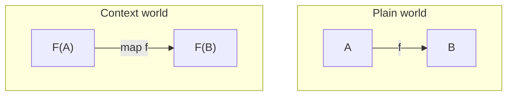

# Part 3：Functor

---

## Chapter 22：Functorとは何か

---

### 問題提起

Part 2 で我々は、バグの正体を次のように捉え直した。

> バグ = 合成の失敗

部分関数、例外、状態。

これらはすべて、型に現れないものが合成を壊す例だった。

そこで我々は、値を裸のまま扱うのではなく、文脈付きの値として扱い始めた。

```ts
type Option<A> = A | null

const head = (xs: number[]): Option<number> =>
  xs.length === 0 ? null : xs[0]
```

これは部分関数を全関数に戻す。

しかし、すぐ次の問題が現れる。

```ts
const first = head([1, 2, 3])

const doubled =
  first === null
    ? null
    : first * 2
```

値は安全になった。

だが、変換するたびに `null` の分岐を手で書いている。

これは単なる冗長さではない。

構造をまだ設計できていないという兆候である。

---

### 直感的説明

我々が本当に書きたいのは、次の写像である。

```text
number -> number
```

たとえば、2倍にする関数。

```ts
const double = (n: number): number =>
  n * 2
```

しかし手元にあるのは `number` ではない。

```text
Option<number>
```

つまり「存在しないかもしれない `number`」である。

通常の関数 `number -> number` は、裸の `number` にしか作用しない。

では、`Option<number>` に対して同じ変換をどう適用するのか。

ここで必要になるのは、値を取り出す技術ではない。

文脈を壊さずに、中身だけを写す構造である。

---

### 抽象の導入

Functor とは、文脈を保存したまま中身の値を写す構造である。

直感的には、次の写像を、



```text
A -> B
```

次の写像へ持ち上げる。

```text
F<A> -> F<B>
```

ここで `F` は文脈である。

`Option` なら、欠落可能性。

`Result` なら、失敗可能性。

`Array` なら、複数性。

`Promise` なら、時間差のある計算。

Functor の中心は `map` である。

しかし `map` は「便利なループ」ではない。

`map` は、文脈を保存したまま写像を行うための構造的な操作である。

---

### TypeScriptコード

```ts
type Option<A> = A | null

const mapOption = <A, B>(
  fa: Option<A>,
  f: (a: A) => B
): Option<B> =>
  fa === null ? null : f(fa)

const head = (xs: number[]): Option<number> =>
  xs.length === 0 ? null : xs[0]

const double = (n: number): number =>
  n * 2

const result: Option<number> =
  mapOption(head([1, 2, 3]), double)
```

呼び出し側から `null` の分岐が消えた。

ただし、`null` が消えたわけではない。

欠落可能性は `Option` の文脈として残っている。

変換したのは中身だけである。

保存したのは構造である。

---

### 数学的補足

圏論的には、Functor は対象と射を写す。

対象 `A` を `F(A)` へ写す。

```text
A |-> F(A)
```

射 `f: A -> B` を `F(f): F(A) -> F(B)` へ写す。

```text
f: A -> B
F(f): F(A) -> F(B)
```

TypeScript の `map` は、この射の対応を値レベルで表現したものとして読める。

ここで重要なのは、`F` が勝手に変わらないことである。

`Option<A>` を `Option<B>` にするなら、変わるのは `A` から `B` だけである。

`Option` という文脈は保存される。

---

### まとめ

Functor は、文脈付きの値に対して通常の写像を適用するための構造である。

その本質は、値の変換と文脈の保存を分離することにある。

AI は `if` 文を量産できる。

しかし設計者は、分岐をどこに閉じ込めるべきかを決めなければならない。

Functor は、その最初の答えである。

---

## Chapter 23：mapの本質

---

### 問題提起

`Result` を考える。

```ts
type Result<E, A> =
  | { type: "ok"; value: A }
  | { type: "error"; error: E }

const parseNumber = (s: string): Result<string, number> => {
  const n = Number(s)
  return Number.isNaN(n)
    ? { type: "error", error: "not a number" }
    : { type: "ok", value: n }
}
```

ここから成功値だけを文字列へ変換したい。

```ts
const parsed = parseNumber("42")

const message =
  parsed.type === "error"
    ? parsed
    : { type: "ok", value: `answer = ${parsed.value}` }
```

このコードは動く。

しかし、呼び出し側が `Result` の内部構造を直接扱っている。

これは危険である。

ある場所ではエラーを保存する。

別の場所ではエラーを握りつぶす。

さらに別の場所ではエラーを成功値に変えてしまう。

同じ型を使っているのに、構造の意味が呼び出し側ごとに変わっていく。

---

### 直感的説明

`map` の本質は、中身だけを写すことにある。

`Result<E, A>` において、中身として写したいのは `A` である。

`E` ではない。

```text
Result<E, A> -> Result<E, B>
```

`A` は `B` に変わる。

しかし `E` は変わらない。

成功か失敗かという文脈も変わらない。

これは制約である。

そして、よい抽象は制約を持つ。

---

### 抽象の導入

`map` の一般形は次である。

```text
map: F<A> -> (A -> B) -> F<B>
```

この型は短い。

しかし、強いことを言っている。

`map` は `A` を見る。

`map` は `B` を作る。

しかし `F` を変えない。

`Result<E, A>` の場合、`E` は文脈の一部である。

したがって `map` は `E` を変換しない。

エラーを別の型に変換したいなら、それは `map` ではなく別の操作である。

抽象とは、できることを増やすだけではない。

してはいけないことを明確にすることでもある。

---

### TypeScriptコード

```ts
type Result<E, A> =
  | { type: "ok"; value: A }
  | { type: "error"; error: E }

const ok = <A>(value: A): Result<never, A> =>
  ({ type: "ok", value })

const error = <E>(error: E): Result<E, never> =>
  ({ type: "error", error })

const mapResult = <E, A, B>(
  fa: Result<E, A>,
  f: (a: A) => B
): Result<E, B> =>
  fa.type === "error"
    ? fa
    : { type: "ok", value: f(fa.value) }

const parsed: Result<string, number> =
  ok(42)

const message: Result<string, string> =
  mapResult(parsed, n => `answer = ${n}`)
```

`mapResult` はエラーを解釈しない。

エラーを翻訳しない。

エラーを成功に戻さない。

成功値だけを写す。

この「だけ」が重要である。

---

### 数学的補足

`Result<E, A>` は、`E` を固定したときに `A` について Functor として読める。

```text
F(A) = Result<E, A>
```

このとき、Functor が写す対象は `A` である。

`E` は固定された文脈である。

TypeScript では型引数が複数あるため、どの型引数について Functor として見るかを設計者が決める必要がある。

これは実装上の細部ではない。

意味論上の選択である。

---

### まとめ

`map` は、変換してよい場所と保存すべき場所を分ける。

この境界がないコードは、AI によって簡単に増殖する。

しかし増殖したコードは、構造を共有しない。

Functor を導入するとは、変換の自由と保存の制約を同時に設計することである。

---

## Chapter 24：Functor則

---

### 問題提起

`map` という名前の関数を作るだけなら簡単である。

次の関数も、型だけ見れば `map` に見える。

```ts
type Option<A> = A | null

const badMapOption = <A, B>(
  fa: Option<A>,
  f: (a: A) => B
): Option<B> =>
  null
```

型は合っている。

しかし、これは `map` ではない。

値を常に捨てているからである。

別の例もある。

```ts
const noisyMapOption = <A, B>(
  fa: Option<A>,
  f: (a: A) => B
): Option<B> => {
  console.log("mapped")
  return fa === null ? null : f(fa)
}
```

これも型だけ見れば `map` である。

しかし余計な効果を持ち込んでいる。

型だけでは、構造の正しさは十分に語れない。

---

### 直感的説明

本物の `map` は、文脈を壊さない。

そのためには、少なくとも次の2つが成り立たなければならない。

何もしない関数を写しても、何も変わらない。

関数を先に合成してから写しても、写してから次を写しても、結果は同じである。

これは気分の問題ではない。

「文脈を保存している」と言うための最低条件である。

---

### 抽象の導入

Functor には2つの法則がある。

1つ目は恒等則である。

```text
map(fa, id) = fa
```

2つ目は合成則である。

```text
map(map(fa, f), g) = map(fa, a => g(f(a)))
```

法則のない抽象は、名前だけの約束である。

法則のある抽象は、合成可能な契約である。

---

### TypeScriptコード

```ts
type Option<A> = A | null

const mapOption = <A, B>(
  fa: Option<A>,
  f: (a: A) => B
): Option<B> =>
  fa === null ? null : f(fa)

const id = <A>(a: A): A =>
  a

const compose =
  <A, B, C>(g: (b: B) => C, f: (a: A) => B) =>
  (a: A): C =>
    g(f(a))

const fa: Option<number> = 10

const identityLeft = mapOption(fa, id)
const identityRight = fa

const f = (n: number): string =>
  `${n}`

const g = (s: string): number =>
  s.length

const compositionLeft =
  mapOption(mapOption(fa, f), g)

const compositionRight =
  mapOption(fa, compose(g, f))
```

このコードはテストそのものではない。

しかし、何を検証すべきかを示している。

確認したいのは、ある入力で偶然期待値になるかではない。

構造が法則を満たすかである。

---

### 数学的補足

圏 `C` から圏 `D` への Functor `F` は、恒等射と合成を保存する。

恒等射については次が成り立つ。

```text
F(id_A) = id_F(A)
```

合成については次が成り立つ。

```text
F(g . f) = F(g) . F(f)
```

TypeScript の `map` で読むなら、これは次に対応する。

```text
map(fa, id) = fa
```

```text
map(fa, a => g(f(a))) = map(map(fa, f), g)
```

恒等則は、余計な変化を起こさないことを要求する。

合成則は、関数合成の構造が文脈内でも保たれることを要求する。

---

### まとめ

Functor は `map` を持つ型ではない。

Functor は、`map` が法則を満たす構造である。

AI はシグネチャに合う関数を生成できる。

しかしシグネチャに合うことと、法則に合うことは違う。

設計者は、型だけでなく法則を要求しなければならない。

---

## Chapter 25：TypeScriptでの表現

---

### 問題提起

Functor の一般形は、概念的には次のように書きたい。

```text
map: F<A> -> (A -> B) -> F<B>
```

したがって、TypeScript でも次のような型を書きたくなる。

```ts
type Functor<F> = {
  map: <A, B>(fa: F<A>, f: (a: A) => B) => F<B>
}
```

しかし、これはそのままでは表現できない。

`F<A>` と書くためには、`F` が型を受け取って型を返すものでなければならない。

TypeScript は、このような高階型を直接扱えない。

ここに HKT、Higher-Kinded Types の問題がある。

---

### 直感的説明

我々が抽象化したいのは、値の型ではない。

型を作るものを抽象化したい。

```text
Option<_>
Result<E, _>
Array<_>
```

これらは、型 `A` を受け取って新しい型を返す。

```text
A |-> Option<A>
```

しかし TypeScript では、この「型から型への関数」を自然な形で引数にできない。

そのため、設計者は2つを分けて考える必要がある。

概念としての Functor。

TypeScript での表現戦略。

この2つは同じではない。

---

### 抽象の導入

TypeScript での現実的な選択肢は複数ある。

1つは、各データ型ごとに具体的な `map` を定義する方法である。

```text
mapOption
mapResult
```

これは単純で読みやすい。

抽象の共有は弱いが、教育用・小規模設計では十分に強い。

もう1つは、URI ベースのエンコーディングを使う方法である。

```text
"Option" + A -> Option<A>
"Result" + E + A -> Result<E, A>
```

これは TypeScript 上で型コンストラクタを近似する手法である。

ただし、複雑さも増える。

本書で重要なのは、最初から型体操をすることではない。

Functor が何を保存し、何を変換するのかを理解することである。

したがって本書では、最初の足場として各データ型ごとに具体的な `map` を置く。

つまり、まずは `mapOption` や `mapResult` で構造を見る。

汎用 `Functor<F>` の表現や HKT エンコーディングは、
その後で必要になった読者だけが進めばよい。

ここで区別したいのは、

1. 抽象そのものを理解すること
2. TypeScript の制約の中でどこまで表現するかを決めること

である。

---

### TypeScriptコード

```ts
type Option<A> = A | null

type Result<E, A> =
  | { type: "ok"; value: A }
  | { type: "error"; error: E }

const mapOption = <A, B>(
  fa: Option<A>,
  f: (a: A) => B
): Option<B> =>
  fa === null ? null : f(fa)

const mapResult = <E, A, B>(
  fa: Result<E, A>,
  f: (a: A) => B
): Result<E, B> =>
  fa.type === "error"
    ? fa
    : { type: "ok", value: f(fa.value) }
```

この段階では、無理に汎用 `Functor<F>` を作らない。

`mapOption` と `mapResult` は別の関数である。

しかし、どちらも同じ構造を持つ。

```text
F<A> -> (A -> B) -> F<B>
```

抽象は、名前を統一することから始まるのではない。

同じ形を見抜くことから始まる。

---

### 数学的補足

圏論の Functor は、TypeScript の `interface` ではない。

対象と射の対応であり、恒等射と合成を保存する写像である。

TypeScript の型システムで `Functor` 風の `interface` を作っても、法則そのものは証明されない。

したがって、TypeScript では次の3層を分ける。

1. 概念としての Functor
2. API としての `map`
3. 法則としての恒等則・合成則

この区別を失うと、`map` という名前の関数があるだけで Functor を実装した気になってしまう。

それは設計として危険である。

---

### まとめ

TypeScript は Functor を学ぶのに十分な言語である。

しかし Functor を完全に型で表すには制限がある。

この制限は欠陥ではない。

むしろ、どの抽象をどこまで表現するかという設計判断を促す境界である。

---

## Chapter 26：実装と検証

---

### 問題提起

抽象は、語っただけでは設計にならない。

使える形に落とし、壊れていないことを確認しなければならない。

ただし、ここで検証したいのは「特定の入力で期待値が返るか」だけではない。

確認したいのは、Functor としての構造が保たれているかである。

つまり、法則である。

---

### 直感的説明

通常のテストは、振る舞いを見る。

```text
入力 1 を渡すと 2 が返る
```

構造のテストは、法則を見る。

```text
何もしない写像は、何もしない
```

```text
2回 map することと、合成して1回 map することは同じ
```

これは「Laws as Tests」である。

このプロジェクトにおけるテストは、単なる品質保証ではない。

抽象が本当に抽象として成立しているかを確認する行為である。

---

### 抽象の導入

`Option` と `Result` について、検証すべき構造は同じである。

恒等則。

```text
map(fa, id) = fa
```

合成則。

```text
map(map(fa, f), g) = map(fa, a => g(f(a)))
```

データ型が違っても、要求される構造は同じである。

ここに抽象の力がある。

---

### TypeScriptコード

```ts
type Option<A> = A | null

type Result<E, A> =
  | { type: "ok"; value: A }
  | { type: "error"; error: E }

const mapOption = <A, B>(
  fa: Option<A>,
  f: (a: A) => B
): Option<B> =>
  fa === null ? null : f(fa)

const mapResult = <E, A, B>(
  fa: Result<E, A>,
  f: (a: A) => B
): Result<E, B> =>
  fa.type === "error"
    ? fa
    : { type: "ok", value: f(fa.value) }

const id = <A>(a: A): A =>
  a

const compose =
  <A, B, C>(g: (b: B) => C, f: (a: A) => B) =>
  (a: A): C =>
    g(f(a))

const optionValue: Option<number> = 42

const optionIdentityLeft =
  mapOption(optionValue, id)

const optionIdentityRight =
  optionValue

const resultValue: Result<string, number> =
  { type: "ok", value: 42 }

const resultIdentityLeft =
  mapResult(resultValue, id)

const resultIdentityRight =
  resultValue

const f = (n: number): string =>
  `${n}`

const g = (s: string): number =>
  s.length

const optionCompositionLeft =
  mapOption(mapOption(optionValue, f), g)

const optionCompositionRight =
  mapOption(optionValue, compose(g, f))

const resultCompositionLeft =
  mapResult(mapResult(resultValue, f), g)

const resultCompositionRight =
  mapResult(resultValue, compose(g, f))
```

このコードは、検証すべき形を示している。

実際のテストでは、`optionIdentityLeft` と `optionIdentityRight` が同じであることを確認する。

同様に、合成則の左右が同じであることを確認する。

`Result` では成功値だけでなく、エラー値でも同じ法則が成り立つべきである。

本書の文脈では、ここでいきなり完全な自動化を目指す必要はない。

まずは、

1. 小さな具体例で law の左右が一致することを確かめる
2. レビュー時に「この `map` は文脈を壊していないか」を見る

この二段階で十分に学習効果がある。

---

### 数学的補足

Functor の検証とは、実装詳細の検証ではない。

次の構造が保たれていることの検証である。

```text
F(id_A) = id_F(A)
```

```text
F(g . f) = F(g) . F(f)
```

`Option` では、`null` という欠落可能性が保存される。

`Result` では、`error` という失敗可能性が保存される。

保存されるべき文脈が変化したなら、その `map` は Functor の `map` ではない。

たとえ TypeScript の型が通っていても、設計としては壊れている。

---

### まとめ

Functor の実装で重要なのは、`map` を書けることではない。

`map` が法則を満たすことである。

`Option` でも `Result` でも、問いは同じである。

```text
中身だけを写しているか。
文脈を保存しているか。
恒等則と合成則を満たしているか。
```

AI 時代において、コードは速く生成される。

だからこそ、人間は法則を要求しなければならない。

Functor は、構造としてのプログラミングにおける最初の本格的な抽象である。

しかし Functor には限界もある。

`A -> B` は扱える。

だが、実際のプログラムでは次の形が頻繁に現れる。

```text
A -> F<B>
```

これを `map` で扱うと、文脈が二重になる。

```text
F<F<B>>
```

このネスト問題を解き、文脈を持つ計算の合成を回復する構造が Monad である。

次の Part では、その問題に進む。
